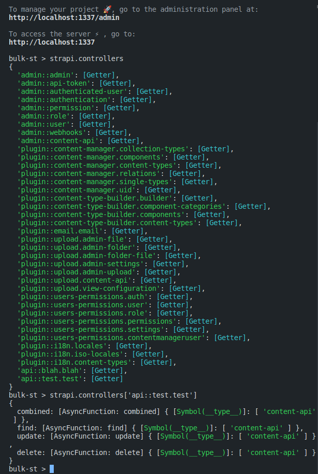

# Example v4 application showing how to combine multiple single types

In this example we have taken two single types and combined them into a single REST response reusing existing controllers and requiring the minimum amount of customization.

You can find the custom route defined here: [1-test-custom.js](src/api/test/routes/1-test-custom.js) which will use the custom controller defined here: [test.js](src/api/test/controllers/test.js).

In this custom controller we are pulling in both of the controller factories and reusing the existing single-type core controllers. The way we got these paths was utilizing the Strapi Console: `yarn strapi console` to explore the internal API:

And here is the example of the response:

~
